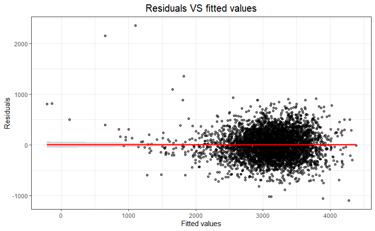
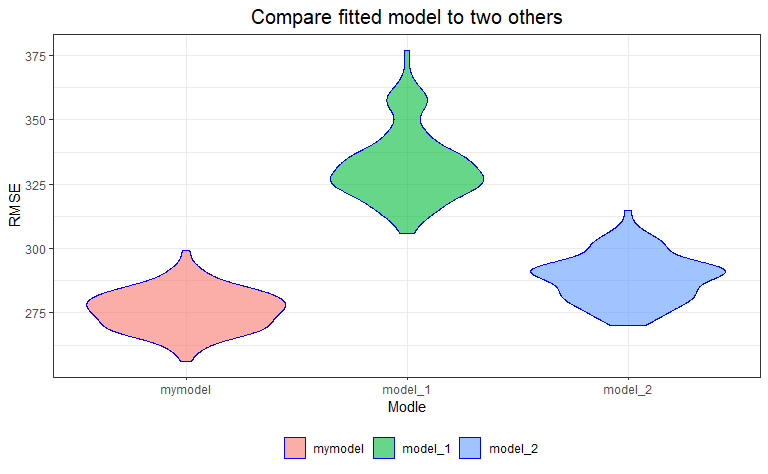
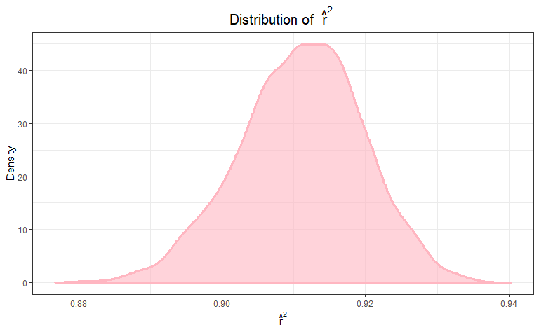
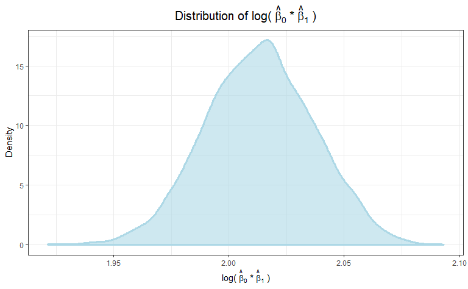

Homework 6
================
Yiyang LIU
2019/11/20

# Problem 1

### Load and clean the data for regression analysis

``` r
bw = read_csv("./data/birthweight.csv") %>% 
  janitor::clean_names() %>% 
  mutate(
    babysex = factor(babysex, levels = c("1", "2")),
    frace = factor(frace, levels = c("1", "2", "3", "4", "8", "9")),
    malform = factor(malform, levels = c("0", "1")),
    mrace = factor(mrace, levels = c("1", "2", "3", "4", "8"))
  ) 
```

    ## Parsed with column specification:
    ## cols(
    ##   .default = col_double()
    ## )

    ## See spec(...) for full column specifications.

    ## Warning in FUN(X[[i]], ...): strings not representable in native encoding
    ## will be translated to UTF-8

``` r
sum(is.na(bw))
```

    ## [1] 0

There is no NAs in the dataset.

### Propose a regression model for birthweight.

``` r
fit = lm(bwt ~ ., data = bw) %>%
  step(direction = "backward")
```

    ## Start:  AIC=48717.83
    ## bwt ~ babysex + bhead + blength + delwt + fincome + frace + gaweeks + 
    ##     malform + menarche + mheight + momage + mrace + parity + 
    ##     pnumlbw + pnumsga + ppbmi + ppwt + smoken + wtgain
    ## 
    ## 
    ## Step:  AIC=48717.83
    ## bwt ~ babysex + bhead + blength + delwt + fincome + frace + gaweeks + 
    ##     malform + menarche + mheight + momage + mrace + parity + 
    ##     pnumlbw + pnumsga + ppbmi + ppwt + smoken
    ## 
    ## 
    ## Step:  AIC=48717.83
    ## bwt ~ babysex + bhead + blength + delwt + fincome + frace + gaweeks + 
    ##     malform + menarche + mheight + momage + mrace + parity + 
    ##     pnumlbw + ppbmi + ppwt + smoken
    ## 
    ## 
    ## Step:  AIC=48717.83
    ## bwt ~ babysex + bhead + blength + delwt + fincome + frace + gaweeks + 
    ##     malform + menarche + mheight + momage + mrace + parity + 
    ##     ppbmi + ppwt + smoken
    ## 
    ##            Df Sum of Sq       RSS   AIC
    ## - frace     4    124365 320848704 48712
    ## - malform   1      1419 320725757 48716
    ## - ppbmi     1      6346 320730684 48716
    ## - momage    1     28661 320752999 48716
    ## - mheight   1     66886 320791224 48717
    ## - menarche  1    111679 320836018 48717
    ## - ppwt      1    131132 320855470 48718
    ## <none>                  320724338 48718
    ## - fincome   1    193454 320917792 48718
    ## - parity    1    413584 321137922 48721
    ## - mrace     3    868321 321592659 48724
    ## - babysex   1    853796 321578134 48727
    ## - gaweeks   1   4611823 325336161 48778
    ## - smoken    1   5076393 325800732 48784
    ## - delwt     1   8008891 328733230 48823
    ## - blength   1 102050296 422774634 49915
    ## - bhead     1 106535716 427260054 49961
    ## 
    ## Step:  AIC=48711.51
    ## bwt ~ babysex + bhead + blength + delwt + fincome + gaweeks + 
    ##     malform + menarche + mheight + momage + mrace + parity + 
    ##     ppbmi + ppwt + smoken
    ## 
    ##            Df Sum of Sq       RSS   AIC
    ## - malform   1      1447 320850151 48710
    ## - ppbmi     1      6975 320855679 48710
    ## - momage    1     28379 320877083 48710
    ## - mheight   1     69502 320918206 48710
    ## - menarche  1    115708 320964411 48711
    ## - ppwt      1    133961 320982665 48711
    ## <none>                  320848704 48712
    ## - fincome   1    194405 321043108 48712
    ## - parity    1    414687 321263390 48715
    ## - babysex   1    852133 321700837 48721
    ## - gaweeks   1   4625208 325473911 48772
    ## - smoken    1   5036389 325885093 48777
    ## - delwt     1   8013099 328861802 48817
    ## - mrace     3  13540415 334389119 48885
    ## - blength   1 101995688 422844392 49908
    ## - bhead     1 106662962 427511666 49956
    ## 
    ## Step:  AIC=48709.53
    ## bwt ~ babysex + bhead + blength + delwt + fincome + gaweeks + 
    ##     menarche + mheight + momage + mrace + parity + ppbmi + ppwt + 
    ##     smoken
    ## 
    ##            Df Sum of Sq       RSS   AIC
    ## - ppbmi     1      6928 320857079 48708
    ## - momage    1     28660 320878811 48708
    ## - mheight   1     69320 320919470 48708
    ## - menarche  1    116027 320966177 48709
    ## - ppwt      1    133894 320984044 48709
    ## <none>                  320850151 48710
    ## - fincome   1    193784 321043934 48710
    ## - parity    1    414482 321264633 48713
    ## - babysex   1    851279 321701430 48719
    ## - gaweeks   1   4624003 325474154 48770
    ## - smoken    1   5035195 325885346 48775
    ## - delwt     1   8029079 328879230 48815
    ## - mrace     3  13553320 334403471 48883
    ## - blength   1 102009225 422859375 49906
    ## - bhead     1 106675331 427525481 49954
    ## 
    ## Step:  AIC=48707.63
    ## bwt ~ babysex + bhead + blength + delwt + fincome + gaweeks + 
    ##     menarche + mheight + momage + mrace + parity + ppwt + smoken
    ## 
    ##            Df Sum of Sq       RSS   AIC
    ## - momage    1     29211 320886290 48706
    ## - menarche  1    117635 320974714 48707
    ## <none>                  320857079 48708
    ## - fincome   1    195199 321052278 48708
    ## - parity    1    412984 321270064 48711
    ## - babysex   1    850020 321707099 48717
    ## - mheight   1   1078673 321935752 48720
    ## - ppwt      1   2934023 323791103 48745
    ## - gaweeks   1   4621504 325478583 48768
    ## - smoken    1   5039368 325896447 48773
    ## - delwt     1   8024939 328882018 48813
    ## - mrace     3  13551444 334408523 48881
    ## - blength   1 102018559 422875638 49904
    ## - bhead     1 106821342 427678421 49953
    ## 
    ## Step:  AIC=48706.02
    ## bwt ~ babysex + bhead + blength + delwt + fincome + gaweeks + 
    ##     menarche + mheight + mrace + parity + ppwt + smoken
    ## 
    ##            Df Sum of Sq       RSS   AIC
    ## - menarche  1    100121 320986412 48705
    ## <none>                  320886290 48706
    ## - fincome   1    240800 321127090 48707
    ## - parity    1    431433 321317724 48710
    ## - babysex   1    841278 321727568 48715
    ## - mheight   1   1076739 321963029 48719
    ## - ppwt      1   2913653 323799943 48743
    ## - gaweeks   1   4676469 325562760 48767
    ## - smoken    1   5045104 325931394 48772
    ## - delwt     1   8000672 328886962 48811
    ## - mrace     3  14667730 335554021 48894
    ## - blength   1 101990556 422876847 49902
    ## - bhead     1 106864308 427750598 49952
    ## 
    ## Step:  AIC=48705.38
    ## bwt ~ babysex + bhead + blength + delwt + fincome + gaweeks + 
    ##     mheight + mrace + parity + ppwt + smoken
    ## 
    ##           Df Sum of Sq       RSS   AIC
    ## <none>                 320986412 48705
    ## - fincome  1    245637 321232048 48707
    ## - parity   1    422770 321409181 48709
    ## - babysex  1    846134 321832545 48715
    ## - mheight  1   1012240 321998651 48717
    ## - ppwt     1   2907049 323893461 48743
    ## - gaweeks  1   4662501 325648912 48766
    ## - smoken   1   5073849 326060260 48771
    ## - delwt    1   8137459 329123871 48812
    ## - mrace    3  14683609 335670021 48894
    ## - blength  1 102191779 423178191 49903
    ## - bhead    1 106779754 427766166 49950

First I use “Stepwise Regression” to choose my model. According to the
results above, I choose `bwt ~ babysex + bhead + blength + delwt +
fincome + gaweeks + mheight + mrace + parity + ppwt +
smoken`.

``` r
mymodel = lm(bwt ~ babysex + bhead + blength + delwt + fincome + gaweeks + mheight + mrace + parity + ppwt + smoken, data = bw)
summary(fit)
```

    ## 
    ## Call:
    ## lm(formula = bwt ~ babysex + bhead + blength + delwt + fincome + 
    ##     gaweeks + mheight + mrace + parity + ppwt + smoken, data = bw)
    ## 
    ## Residuals:
    ##      Min       1Q   Median       3Q      Max 
    ## -1097.18  -185.52    -3.39   174.14  2353.44 
    ## 
    ## Coefficients:
    ##               Estimate Std. Error t value Pr(>|t|)    
    ## (Intercept) -6098.8219   137.5463 -44.340  < 2e-16 ***
    ## babysex2       28.5580     8.4549   3.378 0.000737 ***
    ## bhead         130.7770     3.4466  37.944  < 2e-16 ***
    ## blength        74.9471     2.0190  37.120  < 2e-16 ***
    ## delwt           4.1067     0.3921  10.475  < 2e-16 ***
    ## fincome         0.3180     0.1747   1.820 0.068844 .  
    ## gaweeks        11.5925     1.4621   7.929 2.79e-15 ***
    ## mheight         6.5940     1.7849   3.694 0.000223 ***
    ## mrace2       -138.7925     9.9071 -14.009  < 2e-16 ***
    ## mrace3        -74.8868    42.3146  -1.770 0.076837 .  
    ## mrace4       -100.6781    19.3247  -5.210 1.98e-07 ***
    ## parity         96.3047    40.3362   2.388 0.017004 *  
    ## ppwt           -2.6756     0.4274  -6.261 4.20e-10 ***
    ## smoken         -4.8434     0.5856  -8.271  < 2e-16 ***
    ## ---
    ## Signif. codes:  0 '***' 0.001 '**' 0.01 '*' 0.05 '.' 0.1 ' ' 1
    ## 
    ## Residual standard error: 272.3 on 4328 degrees of freedom
    ## Multiple R-squared:  0.7181, Adjusted R-squared:  0.7173 
    ## F-statistic: 848.1 on 13 and 4328 DF,  p-value: < 2.2e-16

The adjustted R-square of my model is 0.72 and the p-value of F test is
significantly less than 0.05.

### plot of model residuals against fitted values

``` r
bw %>% 
  add_predictions(fit) %>% 
  add_residuals(fit) %>% 
  ggplot(aes(x = pred, y = resid)) +
  geom_point(alpha = 0.5) +
  geom_smooth(method = lm, color = "red")+
  labs(
    titles = "Residuals VS fitted values",
    x = "Fitted values",
    y = "Residuals"
  )
```



### Compare my model to two others

  - My model: `bwt ~ babysex + bhead + blength + delwt + fincome +
    gaweeks + mheight + mrace + parity + ppwt + smoken`

  - Model 1: `bwt ~ blength + gaweeks`

  - Model 2: `bwt ~ babysex + blength + bhead + babysex * blength +
    babysex * bhead + blength * bhead + babysex * blength * bhead`

<!-- end list -->

``` r
set.seed(1)

crossv_mc(bw, 100) %>% 
    mutate(train = map(train, as_tibble),
           test = map(test, as_tibble)) %>% 

    mutate(mymodel = map(train, ~lm(bwt ~ babysex + bhead + blength + gaweeks + mheight + mrace + parity + ppwt + smoken, data = .x)),
           model_1 = map(train, ~lm(bwt ~ blength + gaweeks, data = .x)),
           model_2 = map(train, ~lm(bwt ~ babysex + blength + bhead + babysex * blength + babysex * bhead + blength * bhead + babysex * blength * bhead, data = .x))) %>% 
    mutate(rmse_mymodel = map2_dbl(mymodel, test, ~rmse(model = .x, data = .y)),
           rmse_model_1 = map2_dbl(model_1, test, ~rmse(model = .x, data = .y)),
           rmse_model_2 = map2_dbl(model_2, test, ~rmse(model = .x, data = .y))) %>% 
  select(starts_with("rmse")) %>% 
  gather(key = model, value = rmse) %>% 
  mutate(model = str_replace(model, "rmse_", ""),
         model = fct_inorder(model)) %>% 
  
  ggplot(aes(x = model, y = rmse, fill = model)) + 
  geom_violin(alpha = .6, color = "blue") + 
  labs(title = "Compare fitted model to two others",
       x = "Modle",
       y = "RMSE")
```

    ## Warning in predict.lm(model, data): prediction from a rank-deficient fit
    ## may be misleading



According to the plot, my model has the smallest overall RMSE among the
3 models so I can conclude that my model has more predictive accurary
than the other two. Model 1 is the poorest when being used to describing
what factors can affect baby’s birthweight based on this dataset.

# Problem 2

### Load data

``` r
weather_df = 
  rnoaa::meteo_pull_monitors(
    c("USW00094728"),
    var = c("PRCP", "TMIN", "TMAX"), 
    date_min = "2017-01-01",
    date_max = "2017-12-31") %>%
  mutate(
    name = recode(id, USW00094728 = "CentralPark_NY"),
    tmin = tmin / 10,
    tmax = tmax / 10) %>%
  select(name, id, everything())
```

    ## Registered S3 method overwritten by 'crul':
    ##   method                 from
    ##   as.character.form_file httr

    ## Registered S3 method overwritten by 'hoardr':
    ##   method           from
    ##   print.cache_info httr

    ## file path:          C:\Users\Leah\AppData\Local\rnoaa\rnoaa\Cache/ghcnd/USW00094728.dly

    ## file last updated:  2019-09-26 10:40:25

    ## file min/max dates: 1869-01-01 / 2019-09-30

### A simple linear regression with `tmax` as the response and `tmin` as the predictor

``` r
fit = lm(tmax ~ tmin, data = weather_df)
summary(fit)
```

    ## 
    ## Call:
    ## lm(formula = tmax ~ tmin, data = weather_df)
    ## 
    ## Residuals:
    ##     Min      1Q  Median      3Q     Max 
    ## -6.0304 -2.1245  0.0264  1.7264  9.4915 
    ## 
    ## Coefficients:
    ##             Estimate Std. Error t value Pr(>|t|)    
    ## (Intercept)  7.20850    0.22635   31.85   <2e-16 ***
    ## tmin         1.03924    0.01699   61.16   <2e-16 ***
    ## ---
    ## Signif. codes:  0 '***' 0.001 '**' 0.01 '*' 0.05 '.' 0.1 ' ' 1
    ## 
    ## Residual standard error: 2.938 on 363 degrees of freedom
    ## Multiple R-squared:  0.9115, Adjusted R-squared:  0.9113 
    ## F-statistic:  3741 on 1 and 363 DF,  p-value: < 2.2e-16

The fitted model is $Y =7.21 + 1.04X $ (Y=tmax,
X=tmin)

### Use 5000 bootstrap samples and, for each bootstrap sample, produce estimates of two qauntities

  - \(\widehat {r}^2\)

  - \(\log (\widehat{\beta_o} \times \widehat{\beta_1})\)

<!-- end list -->

``` r
bootstrap = function(x){
  
  model_1 =
    x %>% 
    broom::tidy()
  model_2 =
    x %>%
    broom::glance()
  
  tibble(
    r_squared = pull(model_2, adj.r.squared),
    log_beta0_beta1 = log(pull(model_1, estimate)[1] * pull(model_1, estimate)[2]))
  
}

estimates = 
 weather_df %>% 
  modelr::bootstrap(n = 5000) %>% 
  mutate(
    models = map(strap, ~ lm(tmax ~ tmin, data = .x)),
    results = map(models, bootstrap)) %>% 
  unnest(results) %>%
  select(-strap, -models) 

estimates[1:6,] %>%
  rename("Linear model" = `.id`) %>%
  knitr::kable(align = 'c')
```

| Linear model | r\_squared | log\_beta0\_beta1 |
| :----------: | :--------: | :---------------: |
|     0001     | 0.8974071  |     2.036817      |
|     0002     | 0.9132426  |     1.987364      |
|     0003     | 0.9014805  |     2.037284      |
|     0004     | 0.9035356  |     2.011066      |
|     0005     | 0.9200170  |     1.992120      |
|     0006     | 0.9033351  |     2.022647      |

### The distribution of r\_square

``` r
estimates %>% 
  ggplot(aes(x = r_squared)) +
  geom_density(fill = "light pink", color = "light pink", alpha = .6, size = 1.3) +
  labs( x = expression(""~hat(r)^2~""),
       title = expression("Distribution of "~hat(r)^2~""),
       y = "Density")
```



### The distribution of log(beta\_0\*beata\_1)

``` r
estimates %>% 
  ggplot(aes(x = log_beta0_beta1)) +
  geom_density(fill = "light blue", color = "light blue", alpha = .6, size = 1.3) +
  labs(x = expression("log("~hat(beta)[0]~"*"~hat(beta)[1]~")"),
       title = expression("Distribution of log("~hat(beta)[0]~"*"~hat(beta)[1]~")"),
       y = "Density")
```



Both of the distribution of two estimates are a little left skewed,
indicating that there might be some outliers in the dataset.

### 95% confidence intervals

``` r
r_square_interval = quantile(pull(estimates, r_squared), c(0.025,0.975))
log_b0_b1_interval = quantile(pull(estimates, log_beta0_beta1), c(0.025,0.975))
rbind(r_square_interval, log_b0_b1_interval) %>% 
  knitr::kable(format = "html", align = 'c', caption = "95% confidence interval for estimates")
```

<table>

<caption>

95% confidence interval for estimates

</caption>

<thead>

<tr>

<th style="text-align:left;">

</th>

<th style="text-align:center;">

2.5%

</th>

<th style="text-align:center;">

97.5%

</th>

</tr>

</thead>

<tbody>

<tr>

<td style="text-align:left;">

r\_square\_interval

</td>

<td style="text-align:center;">

0.8934048

</td>

<td style="text-align:center;">

0.9272809

</td>

</tr>

<tr>

<td style="text-align:left;">

log\_b0\_b1\_interval

</td>

<td style="text-align:center;">

1.9669417

</td>

<td style="text-align:center;">

2.0585284

</td>

</tr>

</tbody>

</table>
